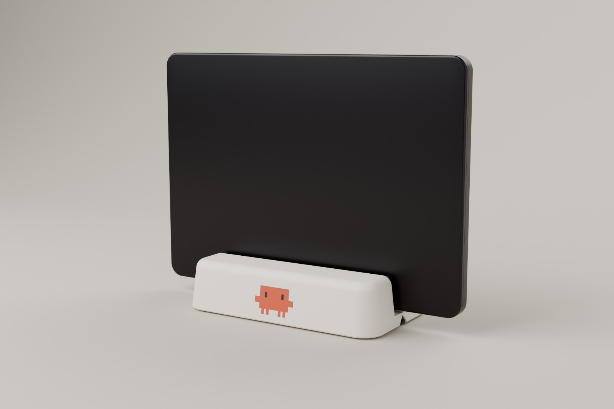
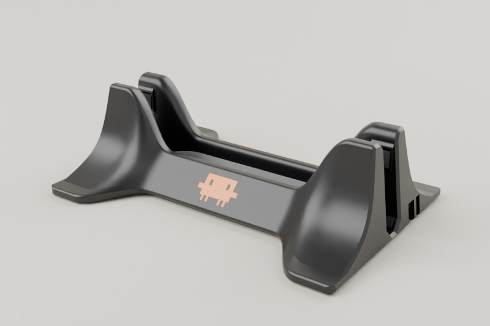
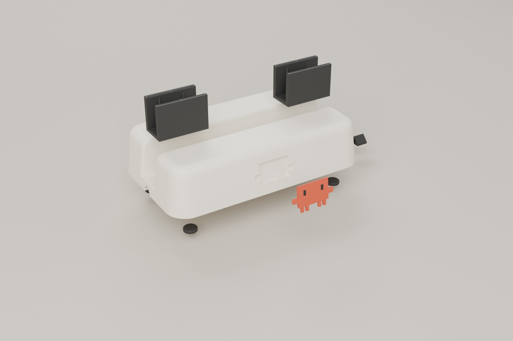
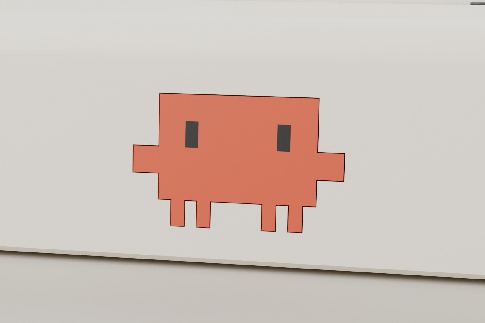
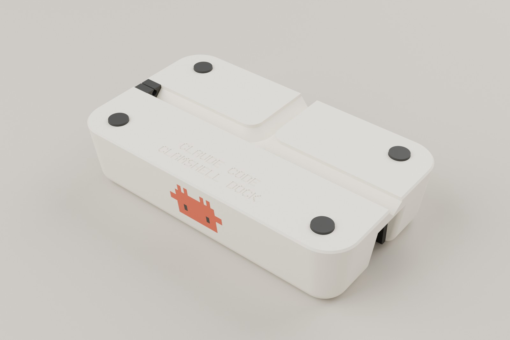
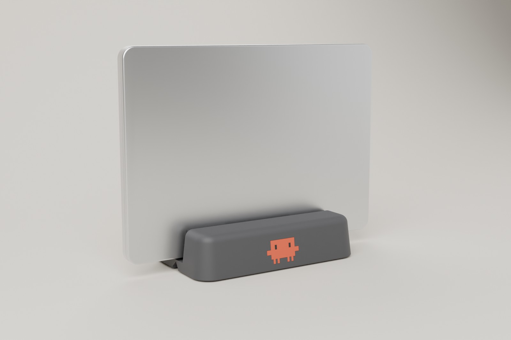

# Claude Code クラムシェルドック（Bambu Lab P2S用）



MacBookを閉じたまま（クラムシェルモード）で立て、充電と接続をしておく縦置きドックです。正面にはClaude Codeのマスコット「Clawd」がはめ込んであります。Bambu Lab P2S（造形範囲256 mm角）で、サポートなしで刷れます。

市販品21製品と3Dプリント作例27件を調べ、次の弱点をつぶしました（[リサーチ](docs/research.md)）。
- 倒れやすい
- 機種に合わない、合う部品が手に入らない
- ケーブルが机の裏に落ちる
- 抜くと台ごと持ち上がる
- 傷が付く、跡が残る

どの寸法でどう対処したかは[設計ノート](docs/design.md)にまとめています。

> **正直なお断り**：この環境にはプリンターも実物のMacBookもないため、試し刷りと実機での装着はしていません。形状（水密性・部品同士の干渉・MacBookとの当たり方）と、スライス・倒れにくさの計算までは検証済みです。TPUライナーのはまり具合はプリンターの調整や銘柄で変わるので、**最初に試し片（長さ16 mm、約6 g・約1時間）を刷ってMacBookの縁に差し、感触を確かめてください**。

| | |
|---|---|
|  |  |
|  |  |

## 特長

| よくある不満 | このドックでの対策 |
|---|---|
| 倒れる・ぐらつく（BookArc Flexが倒れる、1本ネジの台が揺れる） | 奥行116 mm（市販品の多くは88〜112 mm）で低重心。16インチProでも転倒角24.4°。倒れ始める力は5.3 Nで、BookArcの約1.4倍（同条件の計算） |
| 機種に合わない（インサートが出ない・有料、最小幅14 mmで薄いAirが揺れる） | 機種ごとのTPUライナーを自分で刷って差し替え。MacBook Neo、Air（M1〜M5）、Pro 13/14/16に対応。任意の厚みもコマンド1つで作れる |
| ケーブルが机の裏に落ちる | 底面のT字溝に背面から通し、左右好きな側へ。TPUグロメットでケーブルが滑らない |
| 抜くと台が持ち上がる・両手が要る | 薄い膜がしなる「エアクッション」ライナー。押し込みは片側0.025〜0.125 mmで、グリップ力はドックの重さより小さくなるよう設計 |
| 傷・跡・ふたが開く | MacBookに触れるのはTPUのリブだけ（PLA本体とは全機種で非接触）。スロットは平行なので、ふたをこじ開けない |
| 調整がめんどう（六角レンチ、ネジの緩み） | 調整機構なし。ライナーはピンにパチッと押し込むだけ |
| 排熱 | MacBook Proはヒンジを上に立てるのを推奨（排気口とWi-Fiアンテナが背面にあるため）。16インチProの底面は最大約43 °Cで、PLAの荷重たわみ温度57 °Cより低い |

## 対応機種と使うライナー

| お使いのMac | 厚み（Apple公称） | ライナー | 立て方 |
|---|---|---|---|
| MacBook Neo（2026） | 12.7 mm | `neo` | ヒンジを上 |
| MacBook Air 13 / 15（M2〜M5） | 11.3 / 11.5 mm | `air` | どちらでも（ヒンジ上推奨） |
| MacBook Air 13（M1、くさび形） | 4.1〜16.1 mm | `m1air` | **ヒンジを下**。天板を、傾いている壁の側へ |
| MacBook Pro 13（M1/M2） | 15.6 mm | `pro14` | ヒンジを上 |
| MacBook Pro 14（2021〜2026） | 15.5 mm | `pro14` | ヒンジを上 |
| MacBook Pro 16（2021〜2026） | 16.8 mm | `pro16` | ヒンジを上 |

ケースやスキン付き、ほかのノートPCには、厚みを測って専用ライナーを作れます（[カスタマイズ](#カスタマイズ)）。

## 印刷するもの

`print/3mf/` の3MFをBambu Studioで開けば、そのまま刷れます。STLは `print/stl/`、編集用のSTEPは `step/` にあります。

| ファイル | 素材 | 数 | 目安（PrusaSlicerでP2S相当の設定にした概算） |
|---|---|---|---|
| `0_TPU_fit_test_all_liners.3mf`（最初に） | TPU 95A | 自分の機種の1個だけ残して刷る | 1個 5〜8 g、約1時間 |
| `1_body_PLA.3mf` | PLA（Matte推奨）またはPETG | 1 | 252 g、約4時間 |
| `2_logo_clawd_2color_AMS.3mf` | PLA オレンジ＋黒（AMS） | 1 | 2 g、数分（色替え約6回） |
| `3_TPU_liners_<機種>_feet_grommets.3mf` | TPU 95A（HF推奨） | ライナー2、脚4、グロメット2 | 30〜45 g、約2〜3時間 |

AMSがない場合や、ロゴなしにしたい場合は次のファイルを使います。
- `2b_logo_clawd_single_color.3mf`：単色のロゴと、黒い目のピン2個。
- `1b_body_no_logo_PLA.3mf`：くぼみのない本体。

### 色のおすすめ（Bambu PLA Matte）

- 本体：Ivory White（#FFFFFF）、または暖かみのあるDesert Tan（#E8DBB7）
- Clawd：**Terracotta（#B15533）**が公式色 #D77757 に一番近い（色差ΔE約13）。明るめならMandarin Orange（#F99963）
- 目：Charcoal（#000000）
- 黒系の本体にする場合は、目を本体と同じCharcoalにすれば、ロゴは2色で済みます。



## Bambu Studioでの印刷手順（P2S、0.4 mmノズル）

### 1. 本体
1. `1_body_PLA.3mf` を開きます。「Bambu Lab製ではない3MFなので形状のみ読み込む」という通知が出ますが、そのままで問題ありません。
2. プリンターは **Bambu Lab P2S 0.4 nozzle**、プロセスは **0.20mm Standard @BBL P2S** を選びます。
3. 次の設定に変えます。
   - 壁ループ（Wall loops）：**3**
   - 充填密度（Sparse infill density）：**15%**。重くして倒れにくくしたい場合は25〜30%（約380 g、約5.5時間）
   - 充填パターン：グリッドまたはクロスハッチ。ジャイロイドは時間がかなり延びます
4. サポートは**なし**。プレートは付属のテクスチャPEIのままです。
5. 素材はPLA Matteを推奨します。直射日光の当たる場所や夏の車内に置くなら、PETG HFにしてください。

### 2. ロゴ（AMSあり）
1. `2_logo_clawd_2color_AMS.3mf` を開きます。1つのオブジェクトに、`clawd_orange` と `clawd_eyes_black` の2パーツが入っています。
2. 左のオブジェクト一覧でパーツごとにフィラメントを割り当てます。オレンジ系と黒です。パーツを選んで数字キー1〜9を押しても割り当てられます。
3. 見える面がプレート側になる向きで入っています。テクスチャPEIのマットな面がそのまま正面になります。

### 2'. ロゴ（AMSなし）
`2b_logo_clawd_single_color.3mf` をオレンジで刷ります。目は穴になるので、同じファイルに入っている目のピン2個を黒で刷って押し込みます。ピンは小さいので、ブリムを付けてください。本体を黒系で刷る場合は、ピンを入れなくても穴の奥が黒く見えます。

### 3. TPU部品
1. まず `0_TPU_fit_test_all_liners.3mf` を開きます。自分の機種以外の試し片を削除して刷り、MacBookの縁に差して確かめます。スッと入り、手を離しても揺れなければOKです。
2. 合っていたら `3_TPU_liners_<機種>_feet_grommets.3mf` を開きます。
3. フィラメントは **TPU 95A HF** がおすすめです。P2Sでの最大流量は12 mm³/sです。通常のTPU 95Aは3.6 mm³/sで、約3倍時間がかかります。
4. AMS 2 ProはTPU 95Aを通せないので、**外部スプール**から刷ります。「TPU for AMS」（ショア68D）は硬すぎるので、ライナーには向きません。
5. プロセスは0.20mm Standardのままで、壁3・充填20%程度にします。

## 組み立て

1. **脚**：底の4つのくぼみ（Ø13.3、深さ1.5 mm）に、直径12〜13 mmの市販クッションゴムを貼ります（3M バンポン SJ5312など）。印刷したTPU脚（`foot_tpu`）も使えますが、滑りにくさは市販品のほうが上です。
2. **ライナー**：スロットの底にあるピン（左右2本ずつ）にライナー底の穴を合わせ、パチッと言うまで押し込みます。
3. **ロゴ**：正面のくぼみにClawdを押し込むと、面一になります。緩ければ、多用途ボンドか瞬間接着剤を少しだけ付けます。
4. **ケーブル**：ドックを裏返し、背面側の溝からケーブルを入れ、T字で使う側へ曲げます。グロメットのスリットにケーブルを通し、出口の手前に下から押し込みます。1本用はUSB-C／Thunderbolt（4〜6 mm）、2本用はMagSafeなどの細いケーブル向けです。

## 使い方
- MacBookをスロットの真上から差し込みます。入口は面取りしてあり、TPUのリブが中央に導きます。
- MacBook Proは**ヒンジ（ポートのある側）を上**に立てます。ケーブルはポートから下へ垂らし、机の上を通って溝に入ります。
- クラムシェルモードでは電源に接続し、外部キーボードとマウスを使う必要があります（[Apple](https://support.apple.com/en-us/102501)）。
- 上の方にあるUSB-Cポートに抜き差しするときは、ドックを軽く押さえてください。USB-Cの挿抜力は5〜20 Nあります。

## 寸法


本体は200×116×46 mm、スロット幅26 mm（PLA）です。MacBookの縁は机から15.5 mmの高さに来て、左右のTPUが高さ約30 mmの範囲で支えます。

## 検証したこと

- 全部品が閉じたソリッドです（STLを読み直して水密を確認）。
- `src/check_fit.py` で干渉をチェックしました。ロゴ・ライナー・ピンは本体と0 mm³です。MacBook（Neo、Air、Pro）は本体のPLAに触れず、TPUのリブにだけ設計どおり触れます。
- PrusaSlicer 2.7にP2S相当の設定をして、全3MFをスライスしました。サポートは不要でした。45°より緩い下向き面は、次の短い橋渡しだけです。
  - 脚ポケットの天井（Ø13.3）
  - 溝のT字部の頂点（約10 mm）
  - 刻印
  - ロゴくぼみの天井（1 mm）
- 確かめていないこと：
  - 実際の印刷と実機への装着
  - Bambu Studioで開いた結果。インストールできなかったため、Bambu Studioのソースコードを読んで「1オブジェクト＋複数パーツ」として読み込まれることを確認しました

## カスタマイズ

寸法はすべて `src/clamshell_dock.py` の `P` クラスにあります（build123d製）。

```sh
cd src
pip install -r requirements.txt
python3 clamshell_dock.py              # print/ と step/ をすべて作り直す
python3 clamshell_dock.py --liner 14.2 # 厚さ14.2 mmのノートPC用ライナーだけ作る
python3 check_fit.py                   # 変更後の干渉・倒れにくさチェック
```

- 試し片やライナーが緩いときは厚みを0.05〜0.1 mm大きく、きついときは小さくして作り直します。
- 対応できる厚みは約18 mmまでです。それより厚い場合は `slot_w` を広げてください。
- 画像は `render_blender.py`（Blender）と `drawings.py` で作っています。

## ロゴと商標

- Clawdのピクセル配置は、Claude Code CLI（npm `@anthropic-ai/claude-code` 2.0.77）の起動画面の描画データをそのまま使いました。色も同じテーマ値の rgb(215,119,87) です。
- Claude、Claude Code、ClawdはAnthropicの商標です。このモデルのロゴ部分は個人で楽しむためのファン作品で、Anthropicの公式製品ではありません。ロゴ入りのものを販売したり、MakerWorldなどで公開したりする場合は、ロゴなしの本体（`1b_body_no_logo_PLA.3mf`）を使うか、Anthropicの商標ガイドラインを確認してください。
- それ以外のモデルとスクリプトは、リポジトリのMITライセンスに従います。
