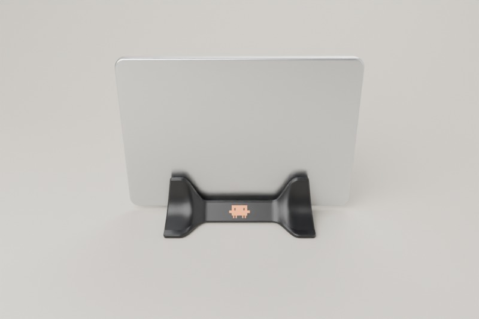
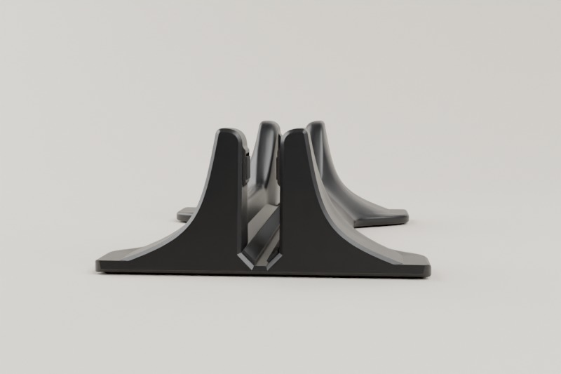
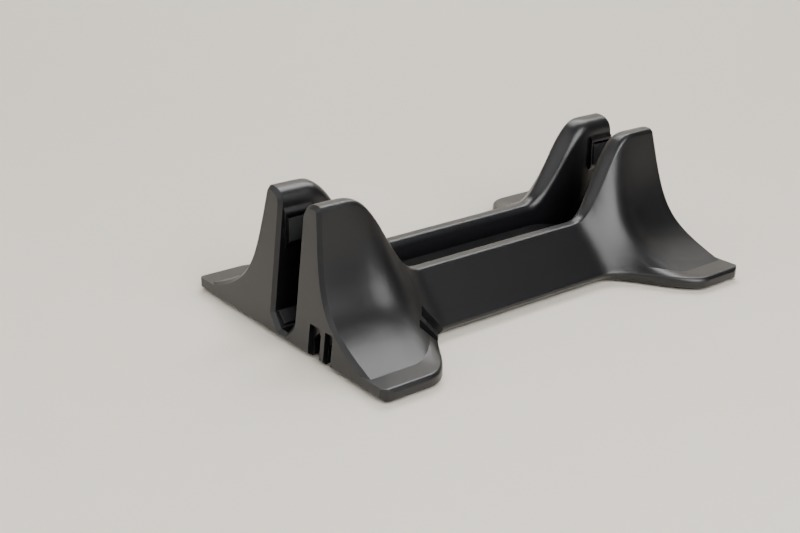
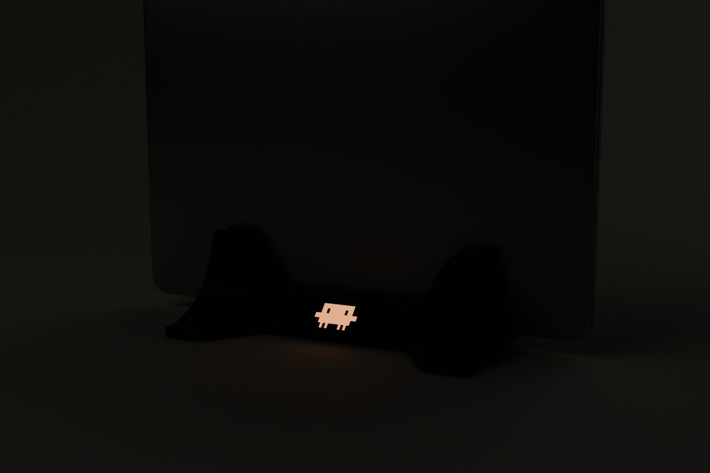

# TŌGE（峠）Claude Code クラムシェルドック（Bambu Lab P2S用）


MacBook Air 13（M2〜M5）を閉じたまま立てておく、縦置きのドックです。黒のPETGで刷る一体の本体に、蓄光のClawdをはめ込みます。

形は峠です。
- 中央は高さ24 mmと低く、Macのヒンジの熱い部分を空気にさらします。
- 両端は高さ60 mmの峰で、富士山の断面をしています。Macを支えるのはこの峰です。端面は7°内側に傾いていて、峰は上へすぼまります。
- 峰の裾は前後に広がっていて、脚をその先端に置いています。倒れにくさは、この裾の広さで出しています。

> **正直なお断り**：この環境にはプリンターも実物のMacBookもないため、試し刷りと実機での装着はしていません。確かめたのは、形状（部品同士の干渉、Macとの当たり方）、スライス、倒れにくさ・たわみ・排熱の計算までです。そのため、本体の前に24 g・1時間ほどの試し刷り（ゲージ）で合わせ具合を確かめられるようにしました。

| | |
|---|---|
|  |  |
|  |  |



## 前の版から変えたこと

市販品と3Dプリント作例の口コミを調べ直し、不満の多い順に対策しました。詳しくは[リサーチ](docs/research.md)と[設計ノート](docs/design.md)にあります。

| 不満 | 対策 |
|---|---|
| 1. 倒れる | 裾を前後138 mmに広げ、脚をその先端に置いた。Macの上端を横に押すと、3.7 Nで奥の脚が浮き始め、4.0 Nで倒れる（前の版は、倒れる力で2.9 N）。フィラメントだけで出しており、おもりは使わない |
| 2. 薄いAirだと緩い、揺れる | Macを受けるのは45°のV溝。ヒンジの角2本の線がフェルトに載るので、印刷の誤差があってもすき間なく中央に座る。上の支えは両端の峰だけで、片側0.3 mmあけてある |
| 3. ケーブルが机の裏に落ちる、引っかけると倒れる | 右端の後ろ側に、ケーブルを下から押し込む通り道がある。高さ8 mmで押さえるので、引っかけてもドックは倒れずに滑る。抜いたプラグは端面のくぼみで待たせる |
| 4. 抜くとドックごと持ち上がる | 何も挟んでいないので、真上に持ち上げればその瞬間にV溝から離れる |
| 5. 傷が付く | Macが触れるのはフェルトだけ。入口はラッパ形に丸く広げてあり、どこから下ろしても角に当たらない |
| 6. 熱 | 中央の84 mmは溝の壁から6 mm以上離し、Macの表面から3 mm以内にPETGがあるのは正面の4.4%だけ（前の版はフェルトで8%を覆っていた） |
| 7. 安っぽく見える | 断面を1本の滑らかな式でつなぎ、継ぎ目のない一体の形にした。左の端面は、富士山の断面をそのまま見せる。印刷の継ぎ目（シーム）は奥に集め、層は0.16 mmにする設定を入れてある |

## 用意するもの

| | もの | 目安 |
|---|---|---|
| 印刷（最初に、任意） | `print/0_fit_gauge_PETG.3mf` 合わせ具合の試し刷り | PETG 24 g、約1時間 |
| 印刷 | `print/1_body_PETG.3mf` 本体 | PETG 185 g、約7.5時間 |
| 印刷 | `print/2_clawd_badge.3mf` Clawdのバッジ（蓄光＋白） | PLA 1.3 g、約5分 |
| 購入済み | 粘着付きフェルト 厚さ2 mm（前の版と同じダイソー「切って使えるフェルトシート 裏面テープ付」）。黒がおすすめ | 1枚で足りる |
| 購入済み | 平らな貼るゴム脚 直径12 mm・高さ2 mm | 4個 |

時間と重さは、PrusaSlicerをP2S相当に設定した概算です。Bambu Studioの見積もりとは食い違います。

## 印刷（Bambu Studio、P2S、0.4 mmノズル）

**本体（黒PETG）**
1. `1_body_PETG.3mf` を開きます。「Bambu Lab製ではない3MF」という通知は、そのままで大丈夫です。
2. フィラメントはBambu PETG、プロセスは0.20mm Standard @BBL P2Sにします。
3. 次の設定は3MFに入れてあります。オブジェクトの一覧で本体を選び、変わっているか確かめてください。
   - 層の高さ：0.16 mm（ゆるい裾の段を細かくするため。急ぐ場合は0.20 mmに戻すと約1時間短くなります）
   - 壁ループ：5
   - 充填：20%（ジャイロイド）
   - 継ぎ目：奥（後ろの面と溝の中に集まる）
   - Bambu Studioのソースコードを読んで作った仕組みで、実機では確かめていません。反映されていなければ、手で設定してください。
4. サポートはなしにします。
5. スライスしたら、プレビューで継ぎ目がClawdのくぼみの中に並んでいないことを確かめます。
6. テクスチャPEIプレートにスティックのりを薄く塗ってから刷ります。PETGがプレートにくっつきすぎるのを防ぐためです。
7. 峰の先が浮いてくる場合だけ、脚の先に小さなブリムを付けます。

**Clawdのバッジ（蓄光PLA＋白PLA）**
1. `2_clawd_badge.3mf` を開きます。1つのオブジェクトに、`badge_glow`（下2 mm）と `badge_white`（上1 mm）の2パーツが入っています。充填100%の設定も入れてあります。
2. 見える面を下にして刷ります。テクスチャPEIのマットな面が正面になります。
3. `badge_glow` に蓄光PLA、`badge_white` に白PLAを割り当てます。
   - 蓄光PLAは研磨性があります。P2SのAMSでは送りのエラーの報告があるので、外部スプールから刷るのが安全です。
   - その場合は、白も同じ外部スプールで刷ります。レイヤーのスライダーで11層目（表示は2.20 mm）に一時停止を入れ、そこで白に差し替えます。
4. 蓄光はオレンジがおすすめです。昼の見た目がClawdの色に一番近くなります。夜の明るさを優先するなら緑です。

PrusaSlicerで開くと、バッジは2つのオブジェクトに分かれ、3MFに入れた設定も読まれません。Bambu StudioかOrcaSlicerを使ってください。

**ゲージ（黒PETG、任意）**
本体と同じ設定で刷ります（3MFに入っています）。中身は次の2つです。
- 峰の断面を8 mmの厚さに切った試し片
- パッドのすき間を5段階で試す櫛

バッジのはまり具合とケーブルの入口の幅は、ゲージでは試しません。どちらも本体を刷ったあとで直せるからです（下の「組み立て」）。

## 組み立て

1. **フェルトを切る**：フェルトシートから次を切り出します。シートの裏の方眼を使うと楽です。
   - 本体のV溝用：幅6 mm×長さ191 mm を2本
   - 本体のパッド用：10×9 mm を4枚
   - ゲージを使う場合は、さらに試し片用に6×8 mmを2枚と7×9 mmを2枚、櫛用に8×19 mmを2枚
2. **ゲージで確かめる（おすすめ）**：本体を刷る前に、ゲージにフェルトを貼って確かめます。
   - 試し片：V溝の両側のくぼみに6×8 mm、パッドのくぼみに7×9 mmを貼り、机に立てます。Macをヒンジ側を下にして差し込みます。Macがまっすぐ立ち、両側のパッドとのすき間がほぼ同じならOKです。
   - 櫛：刻みが3つの溝（すき間0.6 mm）の両側のくぼみに、8×19 mmを底に寄せて貼ります。Macを立てて持ち、上の縁に溝をかぶせて、縁に沿って滑らせます。こすれずに滑ればOKです。
   - こすれる場合は、刻み4つ（0.8 mm）、5つ（1.0 mm）の溝で試します。軽すぎてガタつく場合は、刻み2つ（0.4 mm）、1つ（0.2 mm）の溝で試します。こすれずに通る一番狭い溝を選んでください。
   - 3つの溝以外を選んだ場合や、試し片でMacが片側に寄った場合は、下の「作り直す」の手順で本体を作り直してから刷ります。
3. **フェルトを貼る**：貼る面を#220の紙やすりで軽く荒らし、アルコールで拭いてから貼ります。
   - V溝の両側のくぼみに1本ずつ貼ります。
   - 両端の峰の内側にある4つのくぼみに、パッドを貼ります。
   - しっかり押さえてください。粘着が落ち着くまで、1日ほど置くと確実です。
4. **ゴム脚**：底の四隅の丸いくぼみに貼ります。
5. **Clawd**：目の2本のピンに、バッジの目の穴を合わせて押し込みます。
   - 蓄光の面を外に、頭を奥（Macの側）に向けます。
   - 黒いピンの頭が、そのまま目になります。
   - 外すときは、底の小さな穴から細い棒で押し出します。
   - 固くて入らない、または緩くて落ちる場合は、`--pin-clr`（目の穴）や `--badge-clr`（外形）の数字を変えて、バッジだけを刷り直します（5分）。
6. **ケーブル**：ドックを裏返します。右端の後ろ側にある溝に、MagSafeとUSB-Cのケーブルを下から押し込みます。
   - 太いほう（USB-C／Thunderbolt）が内側、細いほう（MagSafe）が外側の溝です。
   - ケーブルは右の端面から入り、ドックの中で曲がって後ろへ抜けます。出口の近くは上まで切り込みが抜けているので、上から落とし込めます。
   - 入口が狭くてケーブルが入らない場合は、入口の両側をカッターで少し削って広げます。細いケーブルは押し込まなくても溝に収まり、置いたドックが机で下から押さえます。

## 使い方

- **ヒンジを下**にして差します。天板のAppleのマークを手前に向けると、マークが正しい向きで見え、ポートは右下に来ます。
- 入口はどの位置でも幅31 mmあります。上から下ろすだけで、V溝が中央に導きます。モニターの裏でも、手探りのまま片手で差せます。
- 抜くときは、**真上に**持ち上げます。挟んでいないので、ドックは付いてきません。
  - 手前や奥に5°ほど傾けながら抜くと、Macが峰のパッドや溝の壁に押し付けられ、摩擦でドックが浮くことがあります。
  - 両手で抜くときは、峰ではなく裾（脚の上）を押さえてください。峰を両側からつまむと、峰がたわんでMacを挟みます。
  - 気になる場合は、パッドにフェルトの代わりに滑りやすいテープ（超高分子量ポリエチレン）を貼る版を作れます。テープの厚さを `--liner` に入れて作り直します。
- 抜いたMagSafeやUSB-Cのプラグは、右の端面にあるくぼみに差しておきます。プラグは、Macに挿すときと同じ縦向きで待ちます。
- 蓄光のClawdは、部屋の明かりで充電され、消灯後しばらく光ります。2時間ほどで最初の1割ほどの明るさになります。
- Macの向きを逆（Appleのマークを奥）にして使う場合は、ポートが左に来ます。`--cables left` で、ケーブルの通り道を左端に付けた本体を作ってください。

## 排熱について

- ヒンジ（SoCがある側）を下にするので、熱い部分はドックの中にあります。そのため、中央の84 mmはV溝の上を開けたまま、壁をMacから6 mm以上離しました。
- Macに触れるのは、V溝のフェルトの2本の線だけです。Macの表面から3 mm以内にPETGがあるのは、正面の4.4%だけです。
- ヒンジを上にした場合との温度差は、計算では1 °C未満です。実測したデータはないので、気になる場合は下の「実物での確かめ方」で比べてください。
- 本体はPETGです。荷重たわみ温度は62〜68 °Cあり、夏の部屋でMacの縁が50 °C前後になっても余裕があります。バッジはPLAですが、荷重がかからず、Macから14 mm離れています。

## 寸法


- 本体：199×138×60 mm（ゴム脚込みの高さ）
- パッドの間：Macを載せた状態で11.9 mm（Air 11.3 mm＋すき間0.6 mm）
- Macの下端：机から9.6 mm

## 検証したこと

`src/check_fit.py` で確かめた内容です。「作り直す」のオプション（すき間、Macの厚さ、パッドの素材、片寄せ）を変えた場合も、同じ検査を通しています。
- 本体・バッジ・ゲージは、それぞれ1つの閉じたソリッドです。
- バッジとくぼみ・ピンの干渉は0 mm³です。
- V溝に座ったMacは、PETGのどこにも触れません。一番近いところで0.85 mmあります。
  - V溝のフェルトには、2本とも縁から2.5 mm内側で載ります。
  - パッドとのすき間は、Macの重さで本体がたわんだ状態で片側0.3 mmです。
- 中央と峰をつなぐ曲面は、設計した断面の式から0.001 mm以内に収まっています。
- 倒れにくさ（Air 13を立てた状態）：
  - Macの上端を横から押すと、3.7 N（約375 gの力）で奥の脚が浮き始め、4.0 Nで倒れます。
  - 傾けた場合は、30°で脚が浮き始めます。
  - ケーブルを溝の高さ（8 mm）で横に引いた場合は、倒すのに106 Nかかるので、その前にドックが滑るかプラグが抜けます。
- PrusaSlicer 2.7（P2S相当の設定）で3つともスライスしました。サポートは不要です。45°より急な下向きの面は、次の2か所だけで、どちらも短い橋渡しで刷れます。
  - 脚のくぼみの天井
  - プラグ置き場の天井（奥行2 mm）

別のレビュアーが、有限要素法でたわみと強度も計算しました。
- V溝の下は、Macを勢いよく落としても、机に当たって止まるまでに割れる応力には届きません。
- Macの重さでパッドのすき間が閉じる量（片側約0.05 mm）は、パッドの位置で打ち消してあります。

確かめていないことは次の4つです。
- 実際の印刷と、実物のMacでのはまり具合。とくに、ヒンジ側の角の丸みはAppleが公表していないので、ゲージの試し片で確かめてください。
- 実物のフェルトの厚さ（±0.2 mm）
- 排熱の実測
- Bambu Studioで開いた結果。ソースコードを読んで確認しただけです。

**実物での確かめ方**
- **押す**：Macを立てた状態で、上端の中央をキッチンスケールで横に押し、奥の脚が浮き始めたときの値を読みます。370 g以上ならOKです。
- **傾ける**：板に載せて20°傾けても、脚が浮かないことを確かめます。
- **持ち上げる**：1分置いてから真上に持ち上げ、ドックが付いてこないことを確かめます。次に、手前に5°ほど傾けながら持ち上げて、ドックが浮くかどうかを見ます。浮くようなら、真上に抜くようにするか、パッドを滑るテープにします。
- **熱**：ヒンジ上とヒンジ下でCinebenchを20分回し、スコアを比べます。

## 作り直す

```sh
cd src
pip install -r requirements.txt
python3 clamshell_dock.py --c 0.4          # ゲージの櫛で選んだすき間
python3 clamshell_dock.py --v-offset 0.3   # 試し片でMacが奥のパッドに触れたとき（手前なら -0.3）
python3 clamshell_dock.py --mac-t 14.3     # ケースを付けている場合の厚さ
python3 clamshell_dock.py --liner 0.3      # パッドを滑るテープにする場合（テープの厚さを入れる）
python3 clamshell_dock.py --pin-clr 0.15   # バッジの目の穴が固いとき（緩いときは 0.05）
python3 clamshell_dock.py --cables left    # Appleのマークを奥にして使う場合
python3 check_fit.py --c 0.4               # 同じオプションで検査する
```

- オプションは組み合わせて使えます。
- 寸法はすべて `src/clamshell_dock.py` の `P` クラスにあります（build123d製）。
- 画像は `render_blender.py`（Blender）と `drawings.py` で作っています。

## ロゴと商標

- Clawdのピクセル配置は、Claude Code CLI（npm `@anthropic-ai/claude-code` 2.0.77）の起動画面の描画データをそのまま使いました。
- Claude、Claude Code、ClawdはAnthropicの商標です。ロゴ部分は個人で楽しむためのファン作品で、Anthropicの公式製品ではありません。販売したり公開したりする場合は、Anthropicの商標ガイドラインを確認してください。
- それ以外のモデルとスクリプトは、リポジトリのMITライセンスに従います。
