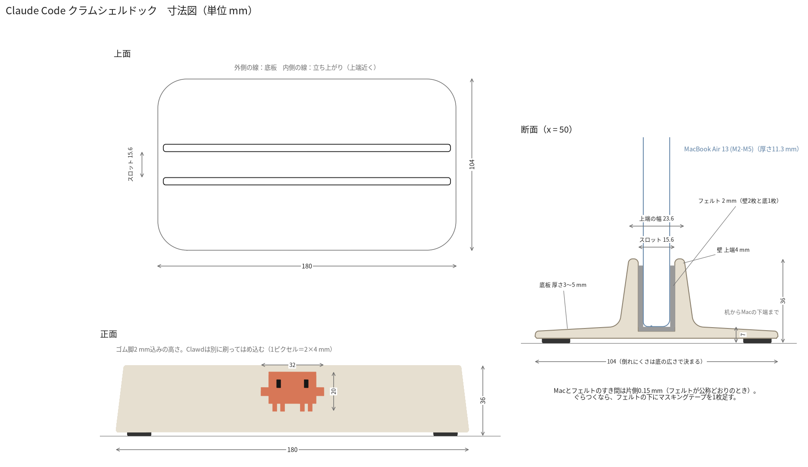

# 設計ノート：寸法の決め方と検証結果

[リサーチ](research.md)で挙がった弱点を、どの寸法・構造でつぶしたかをまとめます。数値は `src/clamshell_dock.py` の `P` クラスが正本です。

## 1. 全体寸法

| 項目 | 値 | 理由 |
|---|---|---|
| 長さ | 200 mm | 一番小さいMacBook Neo（幅297.5 mm）でも左右に48.8 mmはみ出し、側面のポートとゴム脚がドックに掛からない。BookArc（214.8 mm）と同程度。P2Sの256 mm角に収まる |
| 奥行 | 116 mm | 倒れる方向の寸法。市販品の多い範囲は88〜112 mm。16インチProでも転倒角24°を確保（下表） |
| 高さ | 46 mm | MacBookを床から15.5 mm浮かせ、両側30 mmの範囲でTPUが支える |
| 側面の抜き勾配 | 7° | 上がすぼまって軽く見え、重心が低い形になる。印刷時もオーバーハングにならない |
| スロット幅（PLA） | 26 mm | 16.8 mmのPro 16にライナーの膜・空気層・外壁を足した幅。それより厚いノートPCは `slot_w` を広げる |

## 2. 倒れにくさ

MacBookをドックに固定した剛体とみなし、奥行方向の縁を支点に静的に計算しました。ドックの重さはPLA・充填15%の実測スライス値252 g＋TPU部品約40 gで0.29 kgです。

| 機種 | 転倒角 | MacBook上端を横から押して倒れ始める力 |
|---|---|---|
| MacBook Neo | 29.7° | 3.8 N |
| MacBook Air 13 | 28.8° | 3.7 N |
| MacBook Air 15 | 26.2° | 4.0 N |
| MacBook Pro 14 | 27.3° | 4.5 N |
| MacBook Pro 16 | 24.4° | 5.3 N |

同じ条件（16インチPro）で市販品を試算すると次のとおりです。BookArc 17.5°・3.7 N、UGREEN 20471 18°・3.5 N、mTower 22°・5.3 N、OMOTON 24°・5.1 N、Grovemade（1 kg）24°・5.5 N、Kensington（1.5 kg）37°・10.5 N。このドックはアルミ製の上位機種と同等で、BookArcより約4割強い計算です。充填を30%にすると約380 gになり、さらに5%ほど強くなります。滑りは脚で防ぎます。印刷したTPU脚より、市販のウレタン脚（3M バンポン SJ5312、摩擦係数0.9〜1.4）のほうが滑りにくいです。

## 3. TPUライナー（エアクッション膜）

- ライナーは長さ48 mmのU字で、左右に1個ずつ入れます。MacBookに触れるのはTPUだけで、全機種でPLA本体には接触しません（`check_fit.py` で確認）。
- 左右の壁は厚さ1.2 mmの膜になっていて、裏に0.8 mmの空気層があります。膜にある縦リブ（片側4本、半径1 mm）がMacBookに触れます。
- リブの間隔はAppleの公称厚みより少し狭くしてあります。押し込み量は片側0.025〜0.125 mmです。厚みの誤差や印刷のばらつきは、膜が最大0.8 mmしなって吸収します。
- 締め付けをわざと軽くしている理由は2つです。
  1. TPU 95Aは圧縮永久ひずみが大きく、強い締め付けは時間とともに抜けます。
  2. 締め付けが強いと、抜くときにドックごと持ち上がります（mTowerなどの不満点）。
  膜の曲げ剛性をTPU 95Aの弾性率約26 MPaで見積もると、リブ1本あたり0.1 mmで約0.3 Nです。片側4本で約1 N、抜くときの摩擦は約1.5〜3 Nです。ドックの重さは約2.9 Nあり、これを下回ります。TPUの弾性率は銘柄で2倍ほど違うため、この値は目安です。
- 入口は、PLA本体をR3、TPUの膜を45°×0.8 mmで面取りしました。膜のV字ではなく平行なリブで両側から等しく触れるので、ふたをこじ開ける力は掛かりません。
- ライナーは底の穴を本体のピン（首Ø5.0、頭Ø6.1）に押し込むとパチッと留まります。TPUの縁Ø5.4が頭の下に回り込んで抜けを防ぎます。

| 機種 | ライナー | リブ間隔 | 片側の押し込み | 膜の残りストローク | 左右のはみ出し |
|---|---|---|---|---|---|
| MacBook Neo | neo | 12.55 | 0.10 | 0.70 | 48.8 |
| Air 13 (M2〜M5) | air | 11.25 | 0.025 | 0.775 | 52.1 |
| Air 15 (M2〜M5) | air | 11.25 | 0.125 | 0.675 | 70.2 |
| Air 13 (M1) | m1air | 15.85（底部） | 0.125 | 0.675 | 52.1 |
| Pro 13 (M1/M2) | pro14 | 15.35 | 0.125 | 0.675 | 52.1 |
| Pro 14 | pro14 | 15.35 | 0.075 | 0.725 | 56.3 |
| Pro 16 | pro16 | 16.60 | 0.10 | 0.70 | 77.8 |

M1 Airはヒンジ側16.1 mm、手前4.1 mmのくさび形です。ヒンジを下にして差し込み、手前側の壁を3.2°（12/212.4の傾き）傾けて天板に沿わせます。

## 4. Clawdロゴ

- ピクセル配置は、Claude Code CLI（npm `@anthropic-ai/claude-code` 2.0.77 の `cli.js`）が起動画面に描くブロック文字 `▐▛███▜▌ / ▝▜█████▛▘ / ▘▘ ▝▝` をそのまま2×2の区画に分解したものです。色も同じテーマ値（本体 rgb(215,119,87)、目 rgb(0,0,0)）です。@lobehub/icons の「Claude Code」アイコンと同じ比率（1ピクセル＝幅1：高さ2）で、16u×10uです。
- u = 2.5 mmとして40×25 mmにしました。正面の平らな部分（高さ約37 mm）の中央に置いています。
- 縦の面に直接多色で刷ると、ロゴの高さ25 mm（125層）の間ずっと色替えが起き、200回以上になります。そこで**ロゴだけ別に、見える面を下にして刷り**、本体のくぼみにはめ込む方式にしました。色替えは最初の3層（黒い目の0.6 mm）だけで、6回程度です。見える面はテクスチャPEIのマットな質感になります。
- くぼみはロゴより片側0.2 mm大きくしてあります。縦面のくぼみの「天井」（頭の上辺30 mm）はそのままだと30 mmの橋渡しになって垂れ、ロゴが入らなくなるおそれがありました。そこで奥側に45°×1.4 mmの面取りを入れ、ロゴ側にも1.7 mmの面取りを付けています。残る張り出しは1.0 mmだけです。

## 5. ケーブル溝

- 底面に幅13 mmのT字の溝があり、背面中央から左右どちらの端へも通せます。机とドックの間に隠れるので見た目がすっきりします。
- 溝の天井は45°の屋根形（垂直2.5 mm＋屋根6.4 mm）で、橋渡しなしに刷れます。直径6 mmのケーブルを2本並べて通せます。
- 使う出口の近くにTPUグロメットを下から押し込むと、ケーブルが滑って机の裏へ落ちません（BookArcのCable Catchに相当）。1本用（穴Ø4.2、4〜6 mmのUSB-C／Thunderbolt用）と、2本用（穴Ø3.6×2、3.5〜4.5 mm用）の2種類です。側壁に片側0.15 mm圧入します。

## 6. 向きと排熱

- **MacBook Proはヒンジを上にするのがおすすめです**。排気口とWi-Fiアンテナがヒンジの下（背面）にあるためです。MagSafeやUSB-Cもヒンジ寄りにあり、ケーブルは上から垂れます。垂れたケーブルは机の上を通して溝へ入れます。
- MacBook AirとNeoはファンがありません。熱の面ではどちら向きでも構いません。NeoはAppleの寸法図に後端のアンテナとマイクを塞がないよう注記があるので、ヒンジを上にします。
- M1 Airだけは形の都合でヒンジを下にします（ファンレスです）。
- スロットの底とMacBookの縁の間には3 mmのすき間があり、スロットは両端が開いています。空気は抜けますが、ヒンジを下にしたProの排気を想定した設計ではありません。

## 7. 印刷性の検証

| 項目 | 結果 |
|---|---|
| メッシュ | 全部品が水密（STLを読み直して確認） |
| 干渉 | ロゴ・ライナー・ピンと本体は0 mm³。MacBookと本体PLAも0 mm³。MacBookとTPUリブは意図した押し込みのみ（1.3〜14.5 mm³） |
| 下向き面 | 45°より緩い下向き面は、脚ポケットの天井（Ø13.3）、溝のT字部の頂点（約10 mm）、底面の刻印（0.9 mm幅）、ロゴ用くぼみの天井（1.0 mm）だけ。サポートは不要 |
| スライス | PrusaSlicer 2.7にP2Sの「0.20mm Standard」相当の速度・加速度を設定して、全3MFが警告以外エラーなしで通る |

PrusaSlicerは「長いブリッジ」の警告を出しました。G-codeを解析すると、中身は次の3つでした。本当に宙に浮く長い橋渡しはありません。
- 内部のソリッド層（スパース充填の上）
- 刻印の上
- 溝の稜線（幅0.2 mm）

| 印刷物 | フィラメント | 時間（概算） |
|---|---|---|
| 本体（PLA Matte、壁3・充填15%グリッド） | 252 g | 約3時間55分 |
| 本体（充填30%） | 約384 g | 約5時間30分 |
| ロゴ（2色、色替え時間は含まない） | 1.9 g | 約4分＋色替え6回 |
| TPU一式（ライナー2＋脚4＋グロメット2、TPU 95A HF） | 30〜45 g | 約2時間15分〜2時間55分 |

時間はPrusaSlicerの見積もりです。Bambu Studioの見積もりとは食い違うことがあります。

## 8. まだ確かめていないこと

- 実際の印刷と、実物のMacBookでのはまり具合（この作業環境にはプリンターもMacBookもありません）。
- Bambu Studioで開いた結果。コンテナにインストールできなかったため、Bambu Studioのソースコード（`bbs_3mf.cpp`）を読んで確認しました。他社製3MFの「1オブジェクト＋複数コンポーネント」は、1つのオブジェクトの複数パーツとして読み込まれます。
- TPUの弾性率と印刷精度（±0.2〜0.4 mm）による締め付け具合のばらつき。まず試し片（`0_TPU_fit_test_all_liners.3mf`。長さ16 mm、リブは片側1本、ピン穴なし）を刷って確かめてください。合わなければ `--liner` で0.05〜0.1 mm刻みで作り直せます。
